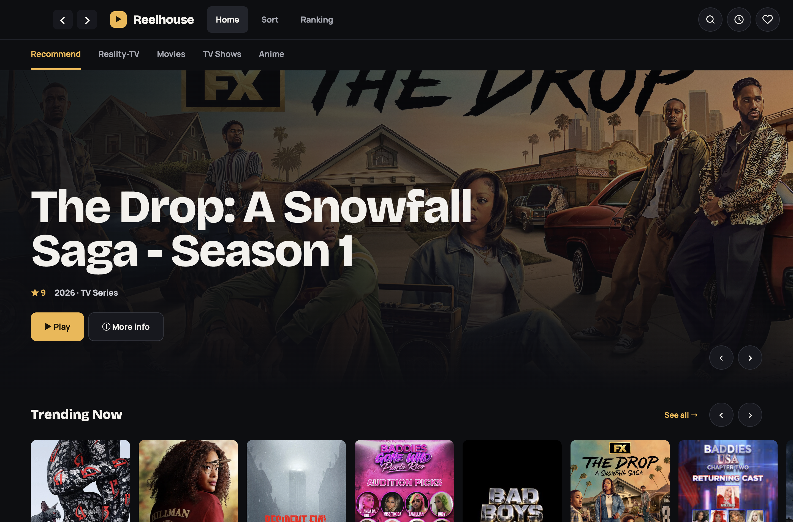
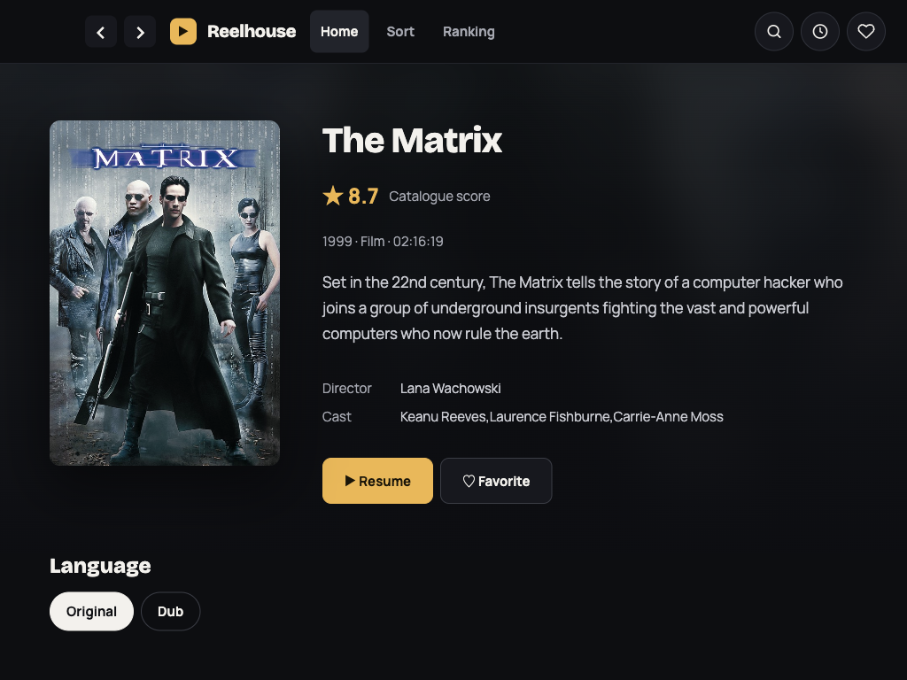
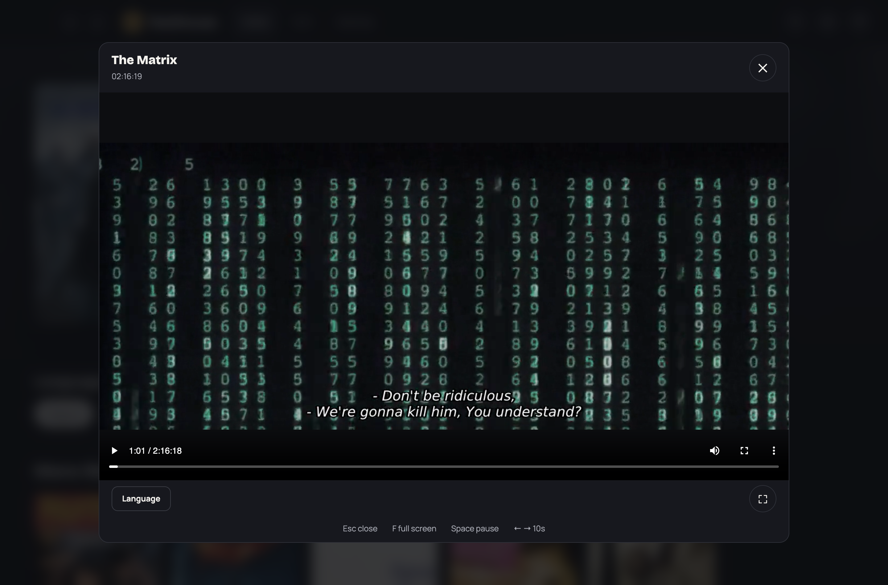

# Reelhouse

Find your next film or show. Pick up where you left off.

Reelhouse brings catalogue browsing and playback to your Mac or Windows PC, with a simple desktop interface and no separate server to set up.

## Download

- **[Stable releases](https://github.com/rickhcchan/reelhouse-releases/releases?q=draft%3Afalse+prerelease%3Afalse)** — recommended for everyday use once the first stable version is available.
- **[Nightly previews](https://github.com/rickhcchan/reelhouse-releases/releases?q=draft%3Afalse+prerelease%3Atrue)** — try the newest changes. Previews may contain bugs.

If no stable release is available yet, start with a preview while Reelhouse is in development.

| Your computer | Choose |
| --- | --- |
| Mac with Apple Silicon (M-series chip) | `Reelhouse-Mac-Apple-Silicon-<version>.dmg` |
| Mac with an Intel processor | `Reelhouse-Mac-Intel-<version>.dmg` |
| Windows PC (64-bit Intel/AMD) | `Reelhouse-Windows-Installer-<version>.exe` |
| Windows PC, portable version | `Reelhouse-Windows-Portable-<version>.exe` |

Filenames include the full version, such as `0.2.0` for stable or `0.2.0-nightly.20261001.12345` for a nightly preview. Mac downloads are DMG only. You do not need Node.js, Python, an IPA or a web server to run a downloaded application.

Use the four clearly labelled app downloads. GitHub also adds automatic “Source code” ZIP/TAR links; these contain only this public downloads repository (documentation and screenshots), **not the private application source**. They are not app installers. `SHA256SUMS` and `release-manifest.json` are download-verification files.

Current Mac builds are not Apple-notarized and Windows builds are unsigned. See the [installation instructions](#installation-and-security-warnings) below if your operating system blocks opening the app.

The app checks for updates in your installed channel: nightly or stable. Updates are optional; download and install a newer version when you choose. Only versions explicitly retired by the maintainer are blocked. A version check is required when opening the app and starting a new video; if that check cannot be reached, retry when your connection is available.

## Installation and security warnings

### macOS

1. Download the DMG for your Mac, open it and drag **Reelhouse** into **Applications**.
2. Open Reelhouse. If macOS says Apple cannot verify the app, click **Done**.
3. Open **System Settings → Privacy & Security**, scroll down to **Security**, then select **Open Anyway** for Reelhouse and confirm. See [Apple's instructions](https://support.apple.com/en-gb/102445).

If **Open Anyway** is missing, the following workaround has been tested for this app. Only use it for a Reelhouse download from this repository that you trust. With Reelhouse installed in Applications, open **Terminal** and run:

```sh
xattr -dr com.apple.quarantine /Applications/Reelhouse.app
```

Then open Reelhouse again. This removes the download quarantine only from Reelhouse; it does not disable Gatekeeper globally. A newly downloaded replacement may need approval again.

Mac builds currently have ad-hoc signatures for bundle integrity, but no Apple Developer ID signature or notarization. A free Apple developer / Personal Team account is insufficient for those distribution services; Apple Developer Program membership is required. Developer ID signing and notarization are not configured for these releases. See [Apple's membership information](https://developer.apple.com/help/account/basics/about-your-developer-account/) and [Developer ID guidance](https://developer.apple.com/developer-id/).

### Windows

Download **Windows Installer** to install Reelhouse, or **Windows Portable** to run it without installation. Both are unsigned and may trigger **Microsoft Defender SmartScreen**, including a **“Windows protected your PC”** warning.

For an unrecognized-app warning, if you trust this repository's download and the options are available, choose **More info → Run anyway**. Signing future builds would identify the publisher and help establish reputation, but would not guarantee immediate removal of SmartScreen warnings. See [Microsoft's explanation](https://learn.microsoft.com/en-us/windows/apps/package-and-deploy/smartscreen-reputation).

Windows 11 **Smart App Control** or an administrator's policy may block the app without a **Run anyway** option. Smart App Control has no individual-app exception; the current preview may not run in that configuration. See [Microsoft's Smart App Control FAQ](https://support.microsoft.com/en-us/windows/security/threat-malware-protection/smart-app-control-frequently-asked-questions).

The Mac workaround was tested on an installed release. The Windows warning/approval flow has not yet been manually verified on a Windows PC; these instructions follow Microsoft's documentation.

## Screenshots

Captured from the macOS desktop preview. Catalogue artwork and available titles can change.

**Browse the catalogue**



<details>
<summary>Title details and playback</summary>

**Title details and audio choices**



**Desktop player**



</details>

## Find something to watch

- Browse film and TV collections, or search for a title.
- Explore genres, years, rankings and streaming-service collections.
- Choose a season, episode and available audio language.
- Watch in fullscreen and resume from your saved position.
- Keep favourites and recently watched titles close at hand.

Press **F** to toggle fullscreen and **Esc** to leave fullscreen. Playback availability depends on the title and source. An internet connection is required.

Favourites and watch history are associated with this installation/device; they do not currently sync between your computers.

## What's available

Reelhouse targets macOS and Windows desktop. Downloads appear here as preview builds are published. Android TV support is planned; Android and iOS downloads are not available yet.

Nightly previews are published after changes merge into the main development branch; they are not limited to an overnight schedule. Stable releases are published separately after a deliberate release decision. PR test builds are kept private.

## Feedback

[Report a problem or suggest an improvement](https://github.com/rickhcchan/reelhouse-releases/issues). Include your app version, operating system and what happened. Please leave out personal file paths, account/device identifiers and credentials.

This repository contains product information and downloadable releases. Development source and build workflows are maintained separately.

## Educational project notice

Reelhouse is an independent educational project based on reverse engineering and interoperability research on the **KayakTime / DELvEK iOS app**, and a demonstration of development assisted by AI coding agents and LLMs. The UI design comes from **Claude Design (Anthropic)**; **Codex (OpenAI)** assists with implementation, investigation, testing, documentation and release automation, under the project owner’s direction and review. It is not an official or affiliated product. Educational use does not grant rights to third-party content or override access restrictions. Read the [full disclaimer](DISCLAIMER.md).

### What we are learning

- Turning a Claude Design handoff into a working desktop interface with Codex.
- Understanding existing app and API behaviour through bounded interoperability research.
- Building a serverless client and reusable logic for future platforms.
- Checking AI-assisted implementation with fixture tests, real-device testing and human review.
- Producing repeatable Mac/Windows builds and controlled releases through GitHub Actions.

This is a record of experimentation with these tools, not a claim that AI-generated designs or code are automatically correct.

## Contributors

Created and maintained by [rickhcchan](https://github.com/rickhcchan), with UI design from **Claude Design (Anthropic)** and AI-assisted development by **Codex (OpenAI)**. See [contributor credits](CONTRIBUTORS.md).
